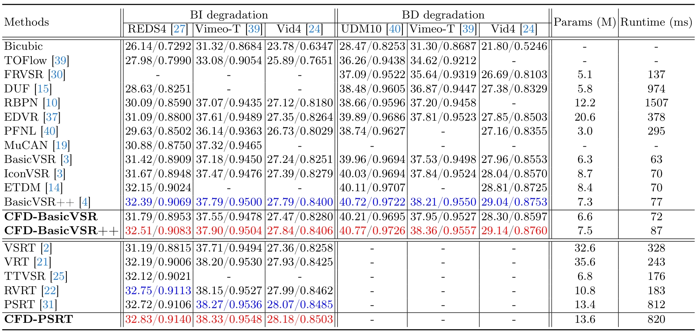

### Collaborative Feedback Discriminative Propagation for Video Super-Resolution
[](https://github.com/House-Leo/CFDVSR)
> [[Paper (arxiv)](https://arxiv.org/abs/2404.04745)] &emsp; [[Project Page](https://github.com/House-Leo/CFDVSR)]

> [Hao Li](https://house-leo.github.io/), [Xiang Chen](https://cschenxiang.github.io/), [Jiangxin Dong](https://scholar.google.com/citations?user=ruebFVEAAAAJ&hl=zh-CN&oi=ao), [Jinhui Tang](https://scholar.google.com/citations?user=ByBLlEwAAAAJ&hl=zh-CN), [Jinshan Pan](https://jspan.github.io/)
[IMAG Lab](https://imag-njust.net/), Nanjing University of Science and Technology

---
<p align="center">
  
</p>

*CFDVSR mainly consists of a propagation module with the discriminative alignment correction (DAC) and a collaborative feedback propagation (CFP) module. The DAC uses shallow features ft to explore more details information after feature warping, which corrects the aligned features for propagation.  The Feedback ConvGRU and gated collaborate feed-forward block (GCFB) in CFP bring more temporal interactions between different timestep featuresfrom forward and backward propagation simultaneously.*

---
### News
- [2024-04-09] The paper is available [here](https://arxiv.org/abs/2404.04745).

### To do
- [ ] Release training code
- [ ] Release testing code and pre-trained models

### Results
- **Quantitative Results**


- **Qualitative Results**


- **Video Demo**

<video width="800" controls="controls" src="./assets/videos/video_demo_015.mp4"></video>

### Citation
If this work is helpful for your research, please consider citing the following BibTeX entry.
```
@article{li2024cfdvsr,
    title={Collaborative Feedback Discriminative Propagation for Video Super-Resolution},
    author={Li, Hao and Chen, Xiang and Dong, Jiangxin and Tang, Jinhui and Pan, Jinshan},
    journal={arXiv preprint arXiv:2404.04745},
    year={2024}
 }
 ```

### Acknowledgement
The README template is borrowed from [SAFMN](https://github.com/sunny2109/SAFMN). Thanks for the awesome work.

### Contact
If you have any questions, please feel free to reach me out at <a href="mailto:haoli@njust.edu.cn">haoli@njust.edu.cn</a>.